#  SpringCloud教程

## 一、前言

### 1.1 微服务架构

微服务架构是一种架构模式，它提倡==将单一应用程序划分成一组小的服务==，服务之间相互协调，为用户提供最终的价值。每个服务运行在独立的进程中，服务与服务之间==采用轻量级的通信机制互相协作==（==通常是基于HTTP协议的RESTful API==），每个服务围绕具体的业务构建，并且能够被独立部署到生产环境、类生产环境中。另外，应当尽量避免统一的、集中式的服务管理机制，对于具体的一个服务而言，应该根据业务上下文，选择合适的语言、工具进行构建。


## 二、工程搭建

构建父工程，后面的项目模块都在此工程中：


设置编码：Settings -> File Encodings

注解激活：

Java版本确定：


### 父工程pom配置

```xml
<?xml version="1.0" encoding="UTF-8"?>

<project xmlns="http://maven.apache.org/POM/4.0.0" xmlns:xsi="http://www.w3.org/2001/XMLSchema-instance"
  xsi:schemaLocation="http://maven.apache.org/POM/4.0.0 http://maven.apache.org/xsd/maven-4.0.0.xsd">
  <modelVersion>4.0.0</modelVersion>

  <groupId>com.dkf.cloud</groupId>
  <artifactId>cloud2020</artifactId>
  <version>1.0-SNAPSHOT</version>
    <!-- 第一步 -->
  <packaging>pom</packaging>

  <!-- 统一管理 jar 包版本 -->
  <properties>
    <project.build.sourceEncoding>UTF-8</project.build.sourceEncoding>
    <maven.compiler.source>1.8</maven.compiler.source>
    <maven.compiler.target>1.8</maven.compiler.target>
    <junit.version>4.12</junit.version>
    <log4j.version>1.2.17</log4j.version>
    <lombok.version>1.16.18</lombok.version>
    <mysql.version>5.1.47</mysql.version>
    <druid.version>1.1.16</druid.version>
    <mybatis.spring.boot.version>1.3.0</mybatis.spring.boot.version>
  </properties>

  <!-- 子块基础之后，提供作用：锁定版本 + 子module不用写 groupId 和 version -->
  <dependencyManagement>
    <dependencies>
        <dependency>
          <groupId>org.apache.maven.plugins</groupId>
          <artifactId>maven-project-info-reports-plugin</artifactId>
          <version>3.0.0</version>
        </dependency>

        <!-- 下面三个基本是微服务架构的标配 -->
        <!--spring boot 2.2.2-->
        <dependency>
          <groupId>org.springframework.boot</groupId>
          <artifactId>spring-boot-dependencies</artifactId>
          <version>2.2.2.RELEASE</version>
          <type>pom</type>
          <scope>import</scope>
        </dependency>
        <!--spring cloud Hoxton.SR1-->
        <dependency>
          <groupId>org.springframework.cloud</groupId>
          <artifactId>spring-cloud-dependencies</artifactId>
          <version>Hoxton.SR1</version>
          <type>pom</type>
          <scope>import</scope>
        </dependency>
        <!--spring cloud 阿里巴巴-->
        <dependency>
          <groupId>com.alibaba.cloud</groupId>
          <artifactId>spring-cloud-alibaba-dependencies</artifactId>
          <version>2.1.0.RELEASE</version>
          <type>pom</type>
          <scope>import</scope>
        </dependency>

        <!--mysql-->
        <dependency>
          <groupId>mysql</groupId>
          <artifactId>mysql-connector-java</artifactId>
          <version>${mysql.version}</version>
          <scope>runtime</scope>
        </dependency>
        <!-- druid-->
        <dependency>
          <groupId>com.alibaba</groupId>
          <artifactId>druid</artifactId>
          <version>${druid.version}</version>
        </dependency>
        <dependency>
          <groupId>org.mybatis.spring.boot</groupId>
          <artifactId>mybatis-spring-boot-starter</artifactId>
          <version>${mybatis.spring.boot.version}</version>
        </dependency>
        <!--junit-->
        <dependency>
          <groupId>junit</groupId>
          <artifactId>junit</artifactId>
          <version>${junit.version}</version>
        </dependency>
        <!--log4j-->
        <dependency>
          <groupId>log4j</groupId>
          <artifactId>log4j</artifactId>
          <version>${log4j.version}</version>
        </dependency>
    </dependencies>
  </dependencyManagement>

  <build>
    <plugins>
      <plugin>
        <groupId>org.springframework.boot</groupId>
        <artifactId>spring-boot-maven-plugin</artifactId>
        <configuration>
          <fork>true</fork>
          <addResources>true</addResources>
        </configuration>
      </plugin>
    </plugins>
  </build>
</project>
```

上面配置的解释：

> 首先要加  <packaging>pom</packaging>  这个。
>
> 聚合版本依赖，dependencyManagement 只声明依赖，并不实现引入，所以子项目还需要写要引入的依赖。
>
> 

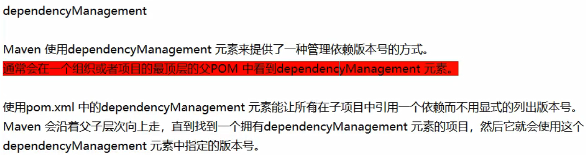


## 三、Eureka-==服务注册中心==

### 3.1 服务治理

Spring Cloud封装了Netflix公司开发的Eureka模块来实现==服务治理==

在传统的rpc远程调用框架中，管理每个服务与服务之间的==依赖关系==比较复杂，服务治理就是用于==管理服务与服务之间依赖关系==，实现==服务调用、负载均衡、容错==等，实现==服务发现与注册==。

### 3.3 服务注册与发现


### 3.4 启动eureka server

server 模块使用 7001端口，下面是pom文件需要的依赖：

```xml
<artifactId>cloud-eureka-server7001</artifactId>

 <dependencies>
     <dependency>
         <groupId>org.springframework.cloud</groupId>
         <artifactId>spring-cloud-starter-netflix-eureka-server</artifactId>
     </dependency>
     <dependency>
         <groupId>org.springframework.boot</groupId>
         <artifactId>spring-boot-starter-web</artifactId>
     </dependency>
     <dependency>
         <groupId>org.springframework.boot</groupId>
         <artifactId>spring-boot-starter-actuator</artifactId>
     </dependency>
     <dependency>
         <groupId>org.mybatis.spring.boot</groupId>
         <artifactId>mybatis-spring-boot-starter</artifactId>
     </dependency>
     <dependency>
         <groupId>org.springframework.boot</groupId>
         <artifactId>spring-boot-devtools</artifactId>
         <scope>runtime</scope>
         <optional>true</optional>
     </dependency>
     <dependency>
         <groupId>org.springframework.boot</groupId>
         <artifactId>spring-boot-starter-test</artifactId>
         <scope>test</scope>
     </dependency>
     <dependency><!-- 引入自己定义的api通用包，可以使用Payment支付Entity -->
         <groupId>com.atguigu.springcloud</groupId>
         <artifactId>cloud-api-commons</artifactId>
         <version>${project.version}</version>
     </dependency>
 </dependencies>
```

下面是yml文件

```yml
server:
port: 7001

eureka:
instance:
 hostname: localhost  # eureka 服务器的实例名称

client:
 # false 代表不向服务注册中心注册自己，因为它本身就是服务中心
 register-with-eureka: false
 # false 代表自己就是服务注册中心，自己的作用就是维护服务实例，并不需要去检索服务
 fetch-registry: false
 service-url:
   # 设置与 Eureka Server 交互的地址，查询服务 和 注册服务都依赖这个地址
   defaultZone: http://${eureka.instance.hostname}:${server.port}/eureka/
```

最后写主启动类，如果启动报错，说没有配置 DataSource ，就在 主启动类的注解加上 这样的配置：

```java
// exclude ：启动时不启用 DataSource的自动配置检查
@SpringBootApplication(exclude = DataSourceAutoConfiguration.class)
@EnableEurekaServer   // 表示它是服务注册中心
public class EurekaServerMain7001 {
 public static void main(String[] args){
     SpringApplication.run(EurekaServerMain7001.class, args);
 }
}
```

启动测试，访问 7001 端口

### 3.5 注册eureka client

#### 3.5.1 注册provider

> 这里的提供者，还是使用 上面的 cloud-provider-payment8001 模块，做如下修改：

1. 在 pom 文件的基础上引入 eureka 的client包，即：

```xml
        <!--eureka-client-->
        <dependency>
            <groupId>org.springframework.cloud</groupId>
            <artifactId>spring-cloud-starter-netflix-eureka-client</artifactId>
        </dependency>
```

全部的依赖展示如下：

```xml
    <artifactId>cloud-provider-payment8001</artifactId>
    <dependencies>
        <!--eureka-client-->
        <dependency>
            <groupId>org.springframework.cloud</groupId>
            <artifactId>spring-cloud-starter-netflix-eureka-client</artifactId>
        </dependency>
        <dependency>
            <groupId>org.springframework.boot</groupId>
            <artifactId>spring-boot-starter-web</artifactId>
        </dependency>
        <dependency>
            <groupId>org.springframework.boot</groupId>
            <artifactId>spring-boot-starter-actuator</artifactId>
        </dependency>
        <dependency>
            <groupId>org.mybatis.spring.boot</groupId>
            <artifactId>mybatis-spring-boot-starter</artifactId>
        </dependency>
        <dependency>
            <groupId>com.alibaba</groupId>
            <artifactId>druid-spring-boot-starter</artifactId>
            <version>1.1.10</version>
        </dependency>
        <!--mysql-connector-java-->
        <dependency>
            <groupId>mysql</groupId>
            <artifactId>mysql-connector-java</artifactId>
        </dependency>
        <!--jdbc-->
        <dependency>
            <groupId>org.springframework.boot</groupId>
            <artifactId>spring-boot-starter-jdbc</artifactId>
        </dependency>
        <dependency>
            <groupId>org.springframework.boot</groupId>
            <artifactId>spring-boot-devtools</artifactId>
            <scope>runtime</scope>
            <optional>true</optional>
        </dependency>
        <dependency>
            <groupId>org.projectlombok</groupId>
            <artifactId>lombok</artifactId>
            <optional>true</optional>
        </dependency>
        <dependency>
            <groupId>org.springframework.boot</groupId>
            <artifactId>spring-boot-starter-test</artifactId>
            <scope>test</scope>
        </dependency>
        <dependency><!-- 引入自己定义的api通用包，可以使用Payment支付Entity -->
            <groupId>com.dkf.cloud</groupId>
            <artifactId>cloud-api-commons</artifactId>
            <version>${project.version}</version>
        </dependency>
    </dependencies>
```

2. 主启动类 加上注解 ：==@EnableEurekaClient==
3. yml 文件添加关于 Eureka 的配置：

```yml
eureka:
  client:
	# 注册进 Eureka 的服务中心
    register-with-eureka: true
    # 检索 服务中心 的其它服务
    fetch-registry: true
    service-url:
      # 设置与 Eureka Server 交互的地址
      defaultZone: http://localhost:7001/eureka/
```


#### 3.5.2 注册consumer

同注册provider一样

### 3.6 Eureka集群

> Eureka 集群的原理，就是 相互注册，互相守望
>
> 模拟多个 Eureka Server 在不同机器上 ： 进入C:\Windows\System32\drivers\etc\hosts  添加如下：
>
> 127.0.0.1 eureka7001
>
> 127.0.0.1 eureka7002

现在创建 cloud-eureka-server7002 ，也就是第二个 Eureka 服务注册中心，pom 文件和 主启动类，与第一个Server一致。

现在修改这两个 Server 的 yml 配置：

7001 端口的Server yml文件：

```yml
server:
  port: 7001

eureka:
  instance:
    hostname: eureka7001  # eureka 服务器的实例地址

  client:
    register-with-eureka: false
    fetch-registry: false
    service-url:
    ## 一定要注意这里的地址，这是搭建集群的关键
      defaultZone: http://eureka7002:7002/eureka/
```

7002 端口的Server yml文件：

```yml
server:
  port: 7002

eureka:
  instance:
    hostname: eureka7002  # eureka 服务器的实例地址

  client:
    register-with-eureka: false
    fetch-registry: false
    service-url:
    ## 一定要注意这里的地址 这是搭建集群的关键
      defaultZone: http://eureka7001:7001/eureka/
```

> eureka.instance.hostname 才是启动以后 本 Server 的注册地址，而 service-url  是 map 类型，只要保证 key:value 格式就行，它代表 本Server 指向了那些 其它Server 。利用这个，就可以实现Eureka Server 相互之间的注册，从而实现集群的搭建。

### 3.7 Provider集群

> 为提供者，即 cloud-provider-payment8001 模块创建集群，新建模块为 cloud-provider-payment8002，其实复制一下改下==端口号，主启动程序名、pom文件中的名字==、还有就是记得==在父项目中添加cloud-provider-payment8002的项目名==
>
> 最终实现：
>
> 
>
> 注意在 Controller 返回不同的消息，比如==端口号==返回区分一下，从而区分者两个提供者的工作状态。

两个provider的主要配置如下：

注意==端口号不一样==，但是==spring.application.name一样==，以对外暴露同样的应用名

```yml
server:
  port: 8001  # 端口号不一样

spring:
  application:
    name: cloud-provider-service  # 这次重点是这里，两个要写的一样，这是这个集群的关键
  datasource:
    type: com.alibaba.druid.pool.DruidDataSource
    driver-class-name: org.gjt.mm.mysql.Driver
    url: jdbc:mysql://localhost:3306/cloud2020?useUnicode=true&characterEncoding=utf-8&useSSL=false
    username: root
    password: 123456

mybatis:
  mapper-locations: classpath:mapper/*.xml
  type-aliases-package: com.atguigu.springcloud.entities  

eureka:
  client:
    register-with-eureka: true
    fetch-registry: true
    service-url:
      defaultZone: http://eureka7001.com:7001/eureka/,http://eureka7002.com:7002/eureka/
```

消费者的配置

> 消费者如何访问由上述两个提供者组成的集群？

==注意Eureka Server上的暴露的提供者的服务名==：


消费者的controller修改如下，主要是将==提供者在Eureka上的名称==换掉以前的url

```java
@RestController
@Slf4j
public class OrderController {
							    // 重点是这里，改成 提供者在Eureka 上的名称，而且无需写端口号	
    public static final String PAYMENY_URL = "http://CLOUD-PROVIDER-SERVICE";

    @Resource
    private RestTemplate restTemplate;

    @PostMapping("customer/payment/create")
    public CommonResult<Payment> create (Payment payment){
        return restTemplate.postForObject(PAYMENY_URL + "/payment/create", payment, CommonResult.class);
    }

    @GetMapping("customer/payment/{id}")
    public CommonResult<Payment> getPaymentById(@PathVariable("id")Long id){
        return restTemplate.getForObject(PAYMENY_URL + "/payment/" + id, CommonResult.class);
    }

}
```

消费者里面对RestTemplate配置的config文件，需要更改成如下：（就是==加一个注解 @LoadBalanced==）

```java
@Configuration
public class ApplicationContextConfig {

    @Bean
    @LoadBalanced  //这个注解，就赋予了RestTemplate 负载均衡的能力
    public RestTemplate getRestTemplate(){
        return new RestTemplate();
    }
}
```

### 3.8 tips:主机名及主机地址

修改在Eureka注册中心显示的==主机名==

微服务所在的==主机地址==

```yml
eureka:
  instance:
  # 主机名
    instance-id: payment8001
    # 主机地址
    prefer-ip-address: true
```


### 3.9 服务发现Discovery

> 对于注册进eureka里面的微服务，可以通过服务发现来获得该服务的信息

1. 在主启动类上添加注解：==@EnableDiscoveryClient==
2. 添加Discoveryclient，注意导入的包名为==org.springframework.cloud.client.discovery.DiscoveryClient==在 Controller 里面打印信息：

```yml
@Resource
    private DiscoveryClient discoveryClient;

    @GetMapping("/customer/discovery")
    public Object discovery(){
        List<String> services = discoveryClient.getServices();
        for(String service: services){
            log.info("*****service: " + service);
        }
        List<ServiceInstance> instances = discoveryClient.getInstances("CLOUD-ORDER-SERVICE");
        for(ServiceInstance serviceInstance:instances){
            log.info(serviceInstance.getServiceId() + "\t" + serviceInstance.getHost()
                    + "\t" + serviceInstance.getPort() + "\t" + serviceInstance.getUri());
        }
        return this.discoveryClient;
    }
```

### 3.10 Eureka的自我保护机制


禁止自我保护:

>在 Eureka Server 的模块中的 yml 文件进行配置：


修改 Eureka Client 模块的 心跳间隔时间：


## 四、Zookeeper-==服务注册中心==

> springCloud整合zookeeper


### 4.1 提供者注册

> 创建一个提供者，使用8003端口

==pom文件如下：==

```xml
<artifactId>cloud-provider-payment8003</artifactId>

    <dependencies>
        <!--springcloud 整合 zookeeper 组件-->
        <dependency>
            <groupId>org.springframework.cloud</groupId>
            <artifactId>spring-cloud-starter-zookeeper-discovery</artifactId>
            <exclusions>
                <exclusion>
                    <groupId>org.apache.zookeeper</groupId>
                    <artifactId>zookeeper</artifactId>
                </exclusion>
            </exclusions>
        </dependency>
        <dependency>
            <groupId>org.apache.zookeeper</groupId>
            <artifactId>zookeeper</artifactId>
            <version>3.5.8</version>
            <exclusions>
                <exclusion>
                    <groupId>org.slf4j</groupId>
                    <artifactId>slf4j-log4j12</artifactId>
                </exclusion>
            </exclusions>
        </dependency>

        <dependency>
            <groupId>com.atguigu.springcloud</groupId>
            <artifactId>cloud-api-commons</artifactId>
            <version>1.0-SNAPSHOT</version>
        </dependency>
        <dependency>
            <groupId>org.springframework.boot</groupId>
            <artifactId>spring-boot-starter-web</artifactId>
        </dependency>
        <dependency>
            <groupId>org.springframework.boot</groupId>
            <artifactId>spring-boot-starter-actuator</artifactId>
        </dependency>
        <dependency>
            <groupId>org.mybatis.spring.boot</groupId>
            <artifactId>mybatis-spring-boot-starter</artifactId>
        </dependency>
        <dependency>
            <groupId>org.springframework.boot</groupId>
            <artifactId>spring-boot-devtools</artifactId>
            <scope>runtime</scope>
            <optional>true</optional>
        </dependency>
        <dependency>
            <groupId>org.projectlombok</groupId>
            <artifactId>lombok</artifactId>
            <optional>true</optional>
        </dependency>
        <dependency>
            <groupId>org.springframework.boot</groupId>
            <artifactId>spring-boot-starter-test</artifactId>
            <scope>test</scope>
        </dependency>
    </dependencies>
```

==主启动类：==

```java
import org.springframework.boot.SpringApplication;
import org.springframework.boot.autoconfigure.SpringBootApplication;
import org.springframework.cloud.client.discovery.EnableDiscoveryClient;

@SpringBootApplication
@EnableDiscoveryClient	
public class PaymentMain8003 {
    public static void main(String[] args){
        SpringApplication.run(PaymentMain8003.class, args);
    }
}
```

==Controller 打印信息：==

```java
@RestController
@Slf4j
public class PaymentController {

    @Resource
    private PaymentService paymentService;

    @Value("${server.port}")
    private String serverPort;

    @RequestMapping("/payment/zk")
    public String paymentzk(){
        return "springcloud with zookeeper :" + serverPort + "\t" + UUID.randomUUID().toString();
    }
}
```

如果 zookeeper 的版本和导入的jar包版本不一致，启动就会报错，由jar包冲突的问题。

解决这种冲突，需要在 pom 文件中，==排除掉引起冲突的jar包，添加和服务器zookeeper版本一致的 jar 包==，但是新导入的 zookeeper jar包又==有 slf4j== 冲突问题，于是再次排除引起冲突的jar包

```xml
<!--springcloud 整合 zookeeper 组件-->
<dependency>
    <groupId>org.springframework.cloud</groupId>
    <artifactId>spring-cloud-starter-zookeeper-discovery</artifactId>
    <!-- 排除与zookeeper版本不一致到导致 冲突的 jar包 -->
    <exclusions>
        <exclusion>
            <groupId>org.apache.zookeeper</groupId>
            <artifactId>zookeeper</artifactId>
        </exclusion>
    </exclusions>
</dependency>
<!-- 添加对应版本的jar包 -->
<dependency>
    <groupId>org.apache.zookeeper</groupId>
    <artifactId>zookeeper</artifactId>
    <version>3.5.8</version>
    <!-- 排除和 slf4j 冲突的 jar包 -->
    <exclusions>
        <exclusion>
            <groupId>org.slf4j</groupId>
            <artifactId>slf4j-log4j12</artifactId>
        </exclusion>
    </exclusions>
</dependency>
```

==yml文件：==

```yml
server:
  port: 8003

spring:
  application:
    name: cloud-provider-service
  cloud:
    zookeeper:
      connect-string: 192.168.205.100:2181
```

==启动测试：==


### 4.2 消费者注册

> 创建测试zookeeper作为服务注册中心的 消费者 模块 cloud-customerzk-order80
>
> 主启动类、pom文件、yml文件和提供者的类似

==config类，注入 RestTemplate==

```java
@SpringBootConfiguration
public class ApplicationContextConfig {
    @Bean
    @LoadBalanced
    public RestTemplate getTemplate(){
        return new RestTemplate();
    }
}
```

==controller层也是和之前类似：==

```java
@RestController
@Slf4j
public class CustomerZkController {

    public static final String INVOKE_URL="http://cloud-provider-service";

    @Resource
    private RestTemplate restTemplate;

    @RequestMapping("/customer/payment/zk")
    public String paymentInfo(){
        String result = restTemplate.getForObject(INVOKE_URL + "/payment/zk",String.class);
        return result;
    }
}
```

关于 zookeeper 的集群搭建，目前使用较少，而且在 yml 文件中的配置也是类似，以列表形式写入 zookeeper 的多个地址即可，而且zookeeper 集群，在 hadoop的笔记中也有记录。总而言之，只要配合zookeeper集群，以及yml文件的配置就能完成集群搭建

## 五、Consul-==服务注册中心==

> consul也是服务注册中心的一个实现，是由go语言写的。官网地址： https://www.consul.io/intro 
>
> 中文地址： https://www.springcloud.cc/spring-cloud-consul.html 
>
> 功能：

### 5.1 安装运行

> 下载地址：https://www.consul.io/downloads.html
>
> 打开下载的压缩包，只有一个exe文件，实际上是不用安装的，在exe文件所在目录打开dos窗口使用即可。
>
> 使用开发模式启动：consul agent -dev
>
> 访问8500端口，即可访问首页

### 5.2 提供者

> 新建提供者模块：cloud-providerconsul-service8006 

==pom 文件：==

```xml
<dependencies>
        <!--springcloud consul server-->
        <dependency>
            <groupId>org.springframework.cloud</groupId>
            <artifactId>spring-cloud-starter-consul-discovery</artifactId>
        </dependency>

        <!-- springboot整合Web组件 -->
        <dependency>
            <groupId>org.springframework.boot</groupId>
            <artifactId>spring-boot-starter-web</artifactId>
        </dependency>
        <dependency>
            <groupId>org.springframework.boot</groupId>
            <artifactId>spring-boot-starter-actuator</artifactId>
        </dependency>

        <!-- 日常通用jar包 -->

        <dependency>
            <groupId>org.springframework.boot</groupId>
            <artifactId>spring-boot-devtools</artifactId>
            <scope>runtime</scope>
            <optional>true</optional>
        </dependency>
        <dependency>
            <groupId>org.projectlombok</groupId>
            <artifactId>lombok</artifactId>
            <optional>true</optional>
        </dependency>
        <dependency>
            <groupId>org.springframework.boot</groupId>
            <artifactId>spring-boot-starter-test</artifactId>
            <scope>test</scope>
        </dependency>
        <dependency><!-- 引入自己定义的api通用包，可以使用Payment支付Entity -->
            <groupId>com.atguigu.springcloud</groupId>
            <artifactId>cloud-api-commons</artifactId>
            <version>${project.version}</version>
        </dependency>
    </dependencies>
```

==yml文件==

```yml
server:
  port: 8006
spring:
  application:
    name: consul-provider-service
  cloud:
    consul:
      host: localhost
      port: 8500
      discovery:    # 指定注册对外暴露的服务名称
        service-name: ${spring.application.name}
```

==主启动类：==

```java
@SpringBootApplication
@EnableDiscoveryClient
public class ConsulProviderMain8006 {
    public static void main(String[] args) {
        SpringApplication.run(ConsulProviderMain8006.class,args);
    }
}
```

controller:其实也就是简单的打印而已

```java
@RestController
@Slf4j
public class PaymentController {
    @Value("${server.port}")
    private String serverPort;

    @RequestMapping("/payment/consul")
    public String paymentConsul(){
        return "springCloud with consul :" + serverPort + "\t" + UUID.randomUUID().toString();
    }
}
```

### 5.3 消费者

> 新建 一个 在82端口的 消费者模块。pom和yml和提供者的类似，==主启动类==不用说，记得==注入RestTemplate==

controller层：

```java
@RestController
public class CustomerConsulController {

    public static final String INVOKE_URL="http://consul-provider-service";

    @Resource
    private RestTemplate restTemplate;

    @RequestMapping("/customer/payment/consul")
    public String paymentInfo(){
        String result = restTemplate.getForObject(INVOKE_URL + "/payment/consul",String.class);
        return result;
    }
}
```

### 5.4 总结

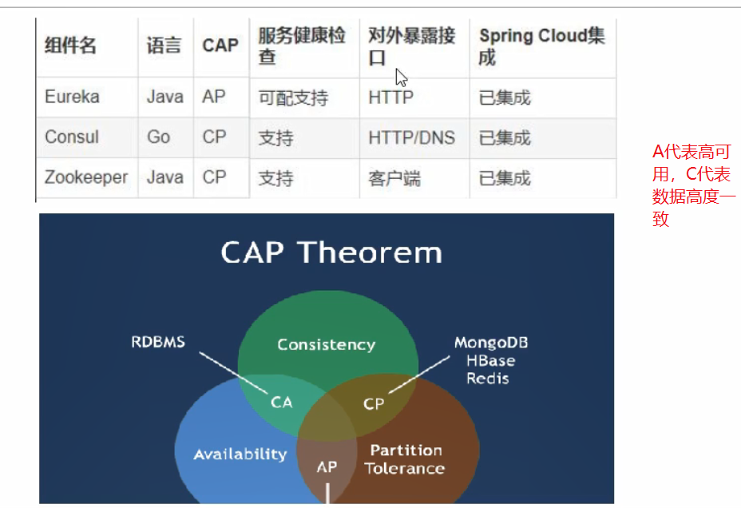


AP:


CP：

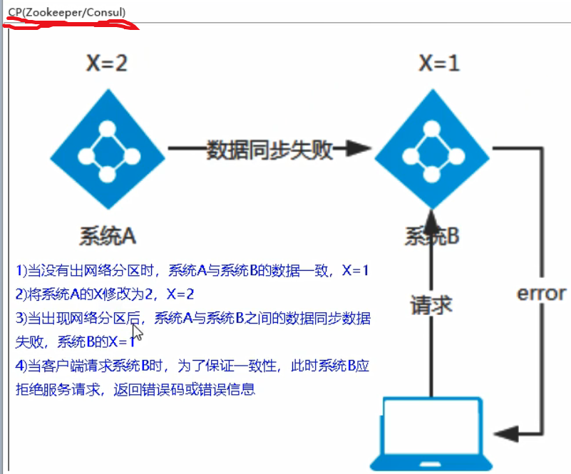

## 六、Ribbon-==服务调用==

> 我们这里提前启动好之前搭建好的eureaka Server集群（==两个eureka Server注册模块，两个提供者模块，一个消费者模块==）


### 6.1 Ribbon简介

Spring Cloud Ribbon是基于Netflix Ribbon实现的一套==客户端负载均衡==工具

简单的说，Ribbon是Netflix发布的开源项目，主要功能是==提供客户端的负载均衡算法和服务调用==。Ribbon客户端组件提供一系列完善的配置项如连接超时，重试等。简单的说，就是在配置文件中列出==Load Balancer==（简称LB）后面的所有的机器，Ribbon会自动的帮助你==基于某种规则（如简单轮询，随机连接等）去连接这些机器==。我们很容易使用Ribbon实现自定义的负载均衡算法

<font color=red>LB负载均衡是什么</font>

简单的说就是将用户的请求平摊的分配到多个服务上，从而达到系统的HA（高可用）。

==常见的负载均衡有Nginx，LVS，硬件F5等==

Ribbon本地负载均衡客户端VS Nginx服务端负载均衡的区别

==Nginx服务器负载均衡==，客户端所有请求都会交给Ngix，然后由Nginx实现转发请求。即负载均衡是由服务端实现的。

Ribbon本地负载均衡，在调用微服务接口时候，会在==注册中心上获取注册信息服务列表之后缓存到JVM本地==，从而在本地实现RPC远程服务调用技术


上面在eureka时，确实实现了==负载均衡机制==，那是因为 eureka-client包里面自带着ribbon：

> 一句话，Ribbon 就是==负载均衡 + RestTemplate 调用==。实际上不止eureka的jar包有，==zookeeper的jar包，还有consul的jar包都包含了他==，就是上面使用的服务调用。


如果自己添加，在 模块的 pom 文件中引入：

```xml
<dependency>
    <groupId>org.springframework.cloud</groupId>
    <artifactId>spring-cloud-starter-netflix-ribbon</artifactId>
</dependency>
```

对于RestTemplate 的一些说明：

> 有两种请求方式：post和get ,还有两种返回类型：object 和 Entity 


RestTemplate 的 ForEntity 相比 ForObject特殊的地方:


就是 如果使用 ForObject 得到的就是提供者返回的对象，而如果要使用==ForEntity 得到时 ResponstEntity对象，使用getBody()==才能得到提供者返回的数据。

```java
	//使用forEnriry示例：
	@GetMapping("customer/payment/forEntity/{id}")
    public CommonResult<Payment> getPaymentById2(@PathVariable("id")Long id){
        
        ResponseEntity<CommonResult> entity = restTemplate.getForEntity(PAYMENY_URL + "/payment/" + id, CommonResult.class);
        
        if(entity.getStatusCode().is2xxSuccessful()){
            return entity.getBody();
        }else{
            return new CommonResult<>(444, "操作失败");
        }
    }
```

## 七、OpenFeign-==服务调用==

### 7.1 概述

> 这里和之前学的dubbo很像，例如==消费者的controller== 可以调用==提供者的 service层==方法，但是不一样，它貌似==只能调用提供者的 controller==，即写一个提供者项目的controller的接口，消费者来调用这个接口方法，就==还是相当于是调用提供者的 controller==，和RestTemplate 没有本质区别


### 7.2 使用

> 新建一个消费者募模块。<font color=red>feign自带负载均衡配置</font>，所以不用手动配置

==pom ：==

```xml
	<dependencies>
        <!-- Open Feign -->
         <dependency>
            <groupId>org.springframework.cloud</groupId>
            <artifactId>spring-cloud-starter-openfeign</artifactId>
        </dependency>
        <!-- eureka Client -->
        <dependency>
            <groupId>org.springframework.cloud</groupId>
            <artifactId>spring-cloud-starter-netflix-eureka-client</artifactId>
        </dependency>
        <dependency><!-- 引入自己定义的api通用包，可以使用Payment支付Entity -->
            <groupId>com.atguigu.springcloud</groupId>
            <artifactId>cloud-api-commons</artifactId>
            <version>${project.version}</version>
        </dependency>
        <dependency>
            <groupId>org.springframework.boot</groupId>
            <artifactId>spring-boot-starter-web</artifactId>
        </dependency>
        <dependency>
            <groupId>org.springframework.boot</groupId>
            <artifactId>spring-boot-starter-actuator</artifactId>
        </dependency>
        <dependency>
            <groupId>org.projectlombok</groupId>
            <artifactId>lombok</artifactId>
            <optional>true</optional>
        </dependency>
        <dependency>
            <groupId>org.springframework.boot</groupId>
            <artifactId>spring-boot-devtools</artifactId>
            <scope>runtime</scope>
            <optional>true</optional>
        </dependency>
        <dependency>
            <groupId>org.springframework.boot</groupId>
            <artifactId>spring-boot-starter-test</artifactId>
            <scope>test</scope>
        </dependency>
    </dependencies>
```

==主启动类：==

```java
@SpringBootApplication
@EnableFeignClients   //关键注解
public class CustomerFeignMain80 {
    public static void main(String[] args) {
        SpringApplication.run(CustomerFeignMain80.class, args);
    }
}
```

==新建一个service==

> 这个service还是 customer 模块的接口，和提供者没有任何关系，不需要包类名一致。它使用起来就相当于是普通的service。
>
> ==推测大致原理，对于这个service 接口，读取它某个方法的注解==（GET或者POST注解不写报错），知道了请求方式和请求地址，而抽象方法，只是对于我们来讲，调用该方法时，可以进行传参等。

```java
@Component
@FeignClient(value = "CLOUD-PROVIDER-SERVICE")  //服务名称，要和eureka上面的一致才行
public interface PaymentFeignService {

    //这个就是provider 的controller层的方法定义,注意要一模一样。
    @GetMapping(value = "/payment/get/{id}")
    public CommonResult getPaymentById(@PathVariable("id")Long id);

}
```

==Controller层：==

```java
//使用起来就相当于是普通的service。
@RestController
public class CustomerFeignController {

    @Resource
    private PaymentFeignService paymentFeignService;

    @GetMapping("customer/feign/payment/{id}")
    public CommonResult<Payment> getPaymentById(@PathVariable("id") Long id){
        return paymentFeignService.getPaymentById(id);
    }
}

```

### 

### 7.3 超时控制

> Openfeign默认超时等待为一秒，在消费者里面配置超时时间

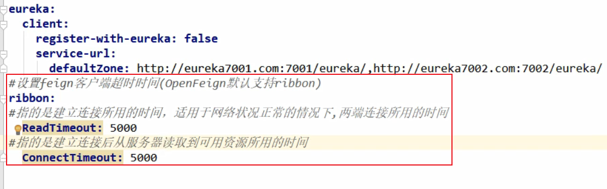

### 7.4 开启日志打印

首先写一个config配置类：

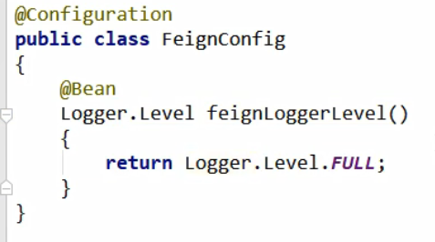

然后在yml文件中开启日志打印配置：

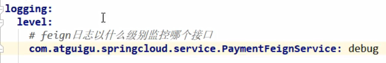

## 中级部分

> 主要是==服务降级、服务熔断、服务限流==的开发思想和框架实现

## 八、Hystrix-springcloud中级

> 官方地址：https://github.com/Netflix/Hystrix/wiki/How-To-Use

### 8.1 概述

#### 8.1.1 服务雪崩

多个微服务之间调用时候，假设微服务A调用微服务B和微服务C，微服务B和微服务C又调用其他的微服务，即所谓的==“扇出”==。如果扇出的链路上某个微服务的调用==响应时间过长或者不可用==，对微服务==A的调用就会占用越来越多的系统资源==，进而引起系统崩溃，即“雪崩效应”。

#### 8.1.2 Hystrix介绍

Hystrix是一个用于处理==分布式系统的延迟==和==容错==的开源库，在分布式系统中，许多依赖不可避免的会调用失败，比如==超时、异常==等。Hystrix能够保证在一个依赖出问题的情况下，==不会导致整体服务的失败，避免级联故障==，以提高分布式系统的弹性

“断路器”本身是一种开关装置，当某个服务单元发生故障之后，通过断路器的故障监控，==向调用方返回一个符合预期的、可处理的备选响应==，而不是长时间的等待或者抛出调用方无法处理的异常，这样就保证了服务调用方的线程不会被长时间、不必要的占用，从而避免了故障在分布式系统中的蔓延，乃至雪崩

#### 8.1.3 服务降级（fallback）

> > 服务降级是指 当服务器压力剧增的情况下，根据==实际业务情况及流量==，对一些服务和页面==有策略的不处理或换种简单的方式处理==，从而释放服务器资源以保证核心业务正常运作或高效运作。说白了，就是==尽可能的把系统资源让给优先级高的服务==。
> >   资源有限，而请求是无限的。如果在并发高峰期，不做服务降级处理，一方面肯定会影响整体服务的性能，严重的话可能会导致宕机某些重要的服务不可用。所以，一般在高峰期，为了保证核心功能服务的可用性，都要对某些服务降级处理。比如当双11活动时，把交易无关的服务统统降级，如查看蚂蚁深林，查看历史订单等等。
>
>   服务降级主要用于什么场景呢？当整个微服务架构整体的负载超出了预设的上限阈值或即将到来的流量预计将会超过预设的阈值时，为了保证重要或基本的服务能正常运行，可以将一些 不重要 或 不紧急 的服务或任务进行服务的 延迟使用 或 暂停使用。
>   降级的方式可以根据业务来，可以延迟服务，比如延迟给用户增加积分，只是放到一个缓存中，等服务平稳之后再执行 ；或者在粒度范围内关闭服务，比如关闭相关文章的推荐。
>
>
>   实现服务降级需要考虑几个问题
>
> 1）那些服务是==核心服务==，哪些服务是非核心服务
> 2）那些服务可以支持降级，那些服务不能支持降级，降级策略是什么
> 3）除服务降级之外是否存在更复杂的业务放通场景，策略是什么？
>   
>   自动降级分类
>   1）==超时降级==：主要配置好超时时间和超时重试次数和机制，并使用异步机制探测回复情况
>   2）==失败次数降级==：主要是一些不稳定的api，当失败调用次数达到一定阀值自动降级，同样要使用异步机制探测回复情况
>   3）==故障降级==：比如要调用的远程服务挂掉了（网络故障、DNS故障、http服务返回错误的状态码、rpc服务抛出异常），则可以直接降级。降级后的处理方案有：默认值（比如库存服务挂了，返回默认现货）、兜底数据（比如广告挂了，返回提前准备好的一些静态页面）、缓存（之前暂存的一些缓存数据）
>   4）==限流降级==：秒杀或者抢购一些限购商品时，此时可能会因为访问量太大而导致系统崩溃，此时会使用限流来进行限制访问量，当达到限流阀值，后续请求会被降级；降级后的处理方案可以是：排队页面（将用户导流到排队页面等一会重试）、无货（直接告知用户没货了）、错误页（如活动太火爆了，稍后重试）。

服务器==忙碌或者网络拥堵==时，==不让客户端等待并立刻返回一个友好提示==

> 程序运行异常
>
> 超时
>
> 服务熔断触发服务降级
>
> 线程池/信号量打满也会导致服务降级

#### 8.1.4 服务熔断(break)

> ==直接拒绝访问==，然后调用==服务降级的方法并返回友好提示==

> 就是保险丝

#### 8.1.5 服务限流（flow limit）

> 　熔断机制是应对雪崩效应的一种==微服务链路保户机制==，当扇出链路的==某个微服务不可用或者响应时间太长时==，会进行服务的降级，进而熔断该节点微服务的调用，快速返回错误的相应信息。==当检测当该节点微服务调用响应正常后恢复调用链路，熔断机制的注解是@HystrixCommand==
>
> 　　“熔断器”本身是一种开关装置，当某个服务单元发生故障之后，通过断路器的故障监控，，某个异常条件被触发，直接熔断整个服务。，向调用方法返回一个符合预期的、可处理的备选响应(FallBack),而不是长时间的等待或者抛出吊牌用方法无法处理的异常，就保证了服务调用方的线程不会被长时间占用，避免故障在分布式系统中蔓延，乃至雪崩

### 8.2 服务降级详解

新建==提供者端的moudle==：cloud-provider-hystrix-payment8001

> ==yml文件==

```yml
server:
  port: 8001
spring:
  application:
    name: cloud-provider-hystrix-payment

eureka:
  client:
    register-with-eureka: true
    fetch-registry: true
    service-url:
      defaultZone: http://eureka7001:7001/eureka,http://eureka7002:7002/eureka


```

> ==pom文件==

``` xml
<dependencies>
        <!-- hystrix -->
        <dependency>
            <groupId>org.springframework.cloud</groupId>
            <artifactId>spring-cloud-starter-netflix-hystrix</artifactId>
        </dependency>
        <!--eureka-client-->
        <dependency>
            <groupId>org.springframework.cloud</groupId>
            <artifactId>spring-cloud-starter-netflix-eureka-client</artifactId>
        </dependency>
        <dependency>
            <groupId>org.springframework.boot</groupId>
            <artifactId>spring-boot-starter-web</artifactId>
        </dependency>
        <dependency>
            <groupId>org.springframework.boot</groupId>
            <artifactId>spring-boot-starter-actuator</artifactId>
        </dependency>
        <dependency>
            <groupId>org.springframework.boot</groupId>
            <artifactId>spring-boot-devtools</artifactId>
            <scope>runtime</scope>
            <optional>true</optional>
        </dependency>
        <dependency>
            <groupId>org.projectlombok</groupId>
            <artifactId>lombok</artifactId>
            <optional>true</optional>
        </dependency>
        <dependency>
            <groupId>org.springframework.boot</groupId>
            <artifactId>spring-boot-starter-test</artifactId>
            <scope>test</scope>
        </dependency>
        <dependency><!-- 引入自己定义的api通用包，可以使用Payment支付Entity -->
            <groupId>com.atguigu.springcloud</groupId>
            <artifactId>cloud-api-commons</artifactId>
            <version>${project.version}</version>
        </dependency>
    </dependencies>
```

==主启动类：==

```java
@SpringBootApplication
@EnableEurekaClient
public class PaymentHystrixMain8001 {
    public static void main(String[] args) {
        SpringApplication.run(PaymentHystrixMain8001.class,args);
    }
}

```

==service层==：很简单的两个访问方法

```java
@Service
public class PaymentService {

    /**
     * 可以正常访问的方法
     * @param id
     * @return
     */
    public String paymentinfo_Ok(Integer id){
        return "线程池：" + Thread.currentThread().getName() + "--paymentInfo_OK，id:" + id;
    }

    /**
    超时访问的方法
    */
    public String paymentinfo_Timeout(Integer id){
        int interTime = 3;
        try{
            TimeUnit.SECONDS.sleep(interTime);
        }catch (Exception e){
            e.printStackTrace();
        }
        return "线程池：" + Thread.currentThread().getName() + "--paymentInfo_Timeout，id:" + id + "耗时" + interTime + "秒钟--";
    }
}
```

==controller层：==

```java
@RestController
@Slf4j
public class PaymentController {

    @Resource
    private PaymentService paymentService;

    @Value("${server.port}")
    private String serverPort;

    @GetMapping("/payment/hystrix/{id}")
    public String paymentInfo_OK(@PathVariable("id")Integer id){
        log.info("paymentInfo_OKKKKOKKK");
        return paymentService.paymentinfo_Ok(id);
    }

    @GetMapping("/payment/hystrix/timeout/{id}")
    public String paymentInfo_Timeout(@PathVariable("id")Integer id){
        log.info("paymentInfo_timeout");
        return paymentService.paymentinfo_Timeout(id);
    }
}
```

#### 8.2.1 模拟高并发

> 这里使用一个新东西 JMeter 压力测试器
>
> 下载压缩包，解压，双击 /bin/ 下的 jmeter.bat 即可启动
>
> 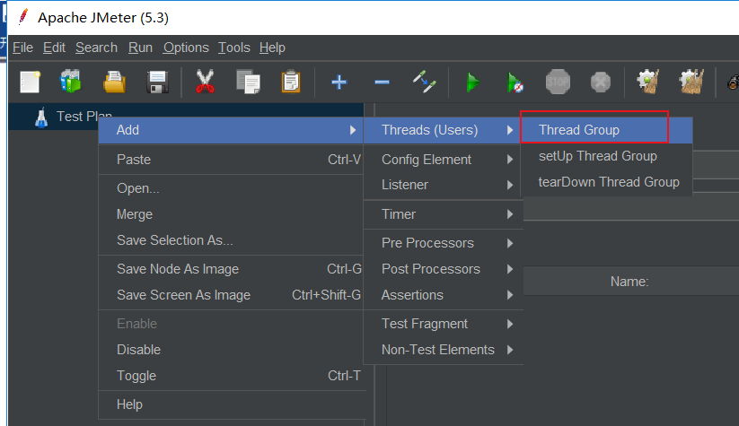
>
> 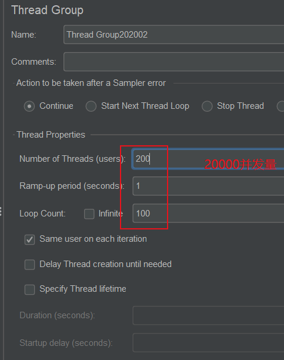
>
> ctrl + S 保存。
>
> 

从测试可以看出，当模拟的==超长请求==被==高并发以后==，访问==普通的小请求速率也会被拉低==。

测试可见，当启动高并发测试时，消费者访问也会变得很慢，甚至出现超时报错

==降级思路==

> 提供者（8001)超时了，调用者（80）不能一直卡死等待，必须有服务降级
>
> 提供者（8001）挂了，调用者（80）不能一直卡死等待，必须有服务降级
>
> 提供者（8001）OK，调用者（80）自己出故障或者有自我要求（自己的等待时间小于提供者的等待时间）

#### 8.2.2 提供者端服务降级

一般服务降级放在客户端，即==消费者端==，但是==提供者端一样能使用==

> 首先提供者，即8001 先从自身找问题，==设置自身调用超时的峰值==，峰值内正常运行，超出峰值需要==有兜底的方法处理，作服务降级fallback==

==对8001的service层进行配置==:主要是==@HystrixCommand==注解和==@HystrixProperty==注解

```java
@HystrixCommand(fallbackMethod = "paymentInfo_timeoutHandler", commandProperties = {
            //设置峰值，超过 3 秒，就会调用兜底方法，这个时间也可以由feign控制
            @HystrixProperty(name="execution.isolation.thread.timeoutInMilliseconds", value = "3000")
    })
    public String paymentinfo_Timeout(Integer id){
        ......会执行5秒.....
    }

	//兜底方法，根据上述配置，程序内发生异常、或者运行超时，都会执行该兜底方法
    public String paymentInfo_timeoutHandler(Integer id){
        .......
    }
}
```

==主启动类添加注解： @EnableCircuitBreaker==，即如下所示：

```java
@SpringBootApplication
@EnableEurekaClient
@EnableCircuitBreaker
public class PaymentHystrixMain8001 {
    public static void main(String[] args) {
        SpringApplication.run(PaymentHystrixMain8001.class,args);
    }
}
```

#### 8.2.3 消费者服务降级

##### 1、具体调用降级

> ==一、yml文件：==
>
> 注意添加：
>
> feign:
>   hystrix:
>     enabled: true

```yml
server:
  port: 80
spring:
  application:
    name: cloud-consumer-hystrix-payment

eureka:
  client:
    register-with-eureka: true
    fetch-registry: true
    service-url:
      defaultZone: http://eureka7001:7001/eureka,http://eureka7002:7002/eureka
feign:
  hystrix:
    enabled: true
```

> ==二、主启动：==
>
> ==// 以feign为服务调用==
>
> @EnableFeignClients
>
> ==// 开启Hystrix==
>
> ==@EnableHystrix==

```java
@SpringBootApplication
@Slf4j
@EnableFeignClients
@EnableHystrix
public class OrderHystrixMain80 {
    public static void main(String[] args) {
        SpringApplication.run(OrderHystrixMain80.class,args);
    }
}
```

> 三、Controller改动
>
> 注意，==利用feign调用提供端的代码不再赘述==
>
> 这里主要是==@HystrixCommand==的使用，和在提供端使用是一样

``` java
@RestController
@Slf4j
public class OrderHystrixController {
    @Resource
    private OrderHystrixService orderHystrixService;
    
   @GetMapping("/consumer/payment/hystrix/timeout/{id}")
   @HystrixCommand(fallbackMethod = "paymentTimeOutFallbackMethod",
            commandProperties = {@HystrixProperty(name = "execution.isolation.thread.timeoutInMilliseconds", value = "1500")})
  public String paymentInfo_Timeout(@PathVariable("id") Integer id) {
      return orderHystrixService.paymentInfo_Timeout(id);
  }
    
   public String paymentTimeOutFallbackMethod(@PathVariable("id") Integer id) {
        return "我是消费者80，对方支付系统繁忙，请10秒钟后再试或自己运行出错，请检查自己";
    }

}
```

##### 2、全局服务降级

> 上面的降级策略，很明显造成了代码的杂乱，提升了耦合度，而且按照这样，每个方法都需要配置一个兜底方法，很繁琐。现在将降级处理方法（兜底方法）做一个全局的配置，设置==共有的兜底方法和独享的兜底方法==。

> 改动Controller即可
>
> 主要==使用@DefaultProperties注解==

```java
@RestController
@Slf4j
@DefaultProperties(defaultFallback = "payment_Global_FallbackMethod")
public class OrderHystrixController {
    @Resource
    private OrderHystrixService orderHystrixService;

    @GetMapping("/consumer/payment/hystrix/timeout/{id}")
    // 没有具体指明是哪种降级方法，所以使用的是全局的降级方法，
    // @HystrixCommand注解需要用到
    // @HystrixCommand 
    // @HystrixCommand 也可以不配置别的东西,默认使用全局,而且是一些运行异常时的降级策略
     // 不写自己的 fallbackMethod 属性，就使用全局默认的
    @HystrixCommand(commandProperties = {           @HystrixProperty(name="execution.isolation.thread.timeoutInMilliseconds", value = "3000")
    })
    public String paymentInfo_Timeout(@PathVariable("id") Integer id) {
        // 比如...,则默认使用全局,如果没有特别指定
        int age=10/0;
        return orderHystrixService.paymentInfo_Timeout(id);

    }

    // 下面是全局fallback方法
    public String payment_Global_FallbackMethod(){
        return "Global 异常处理信息，请稍后重试";
    }
```

问题-跟业务逻辑混合，解决（解耦）：

> 在这种方式一般是在客户端，即消费者端，首先上面再controller中添加的  ==@HystrixCommand 和 @DefaultProperties== 两个注解去掉。就是保持原来的controller

1. ==yml文件配置==

```yml
server:
  port: 80
spring:
  application:
    name: cloud-customer-feign-hystrix-service
eureka:
  client:
    register-with-eureka: true
    fetch-registry: true
    service-url:
      defaultZone: http://eureka7001.com:7001/eureka/

# 用于服务降级 在注解@FeignClient 中添加 fallback 属性值
feign:
  hystrix:
    enabled: true  # 在feign中开启 hystrix
```

2. ==修改service 接口：==

> ==重点是:fallback属性==

```java
@Component											// 这里是重点
@FeignClient(value = "CLOUD-PROVIDER-HYSTRIX-PAYMENT", fallback = OrderFallbackService.class)
public interface OrderService {

    @GetMapping("/payment/hystrix/{id}")
    public String paymentInfo_OK(@PathVariable("id")Integer id);

    @GetMapping("/payment/hystrix/timeout/{id}")
    public String paymentInfo_Timeout(@PathVariable("id")Integer id);

}
```

3. ==fallback 指向的类：==

```java
package com.atguigu.springcloud.service;

import org.springframework.stereotype.Component;

@Component						
//注意这里，它实现了service接口
public class OrderFallbackService implements  OrderService{


    @Override
    public String paymentInfo_OK(Integer id) {
        return "OrderFallbackService --发生异常";
    }

    @Override
    public String paymentInfo_Timeout(Integer id) {
        return "OrderFallbackService --发生异常--paymentInfo_Timeout";
    }
}
```

新问题，这样配置如何设置超时时间？

> 首先要知道 下面两个 yml 配置项：
>
> ```properties
> hystrix.command.default.execution.timeout.enable=true    ## 默认值
> 
> ## 为false则超时控制有ribbon控制，为true则hystrix超时和ribbon超时都是用，但是谁小谁生效，默认为true
> 
> hystrix.command.default.execution.isolation.thread.timeoutInMilliseconds=1000  ## 默认值
> 
> ## 熔断器的超时时长默认1秒，最常修改的参数
> ```
>
> 看懂以后，所以：
>
> 只需要在yml配置里面配置 Ribbon 的 超时时长即可。注意：hystrix 默认自带 ribbon包。
>
> ```yml
> ribbon:
> 	ReadTimeout: xxxx
> 	ConnectTimeout: xxx
> ```

### 8.3 服务熔断

> 实际上服务熔断 和 服务降级 没有任何关系，就像 java 和 javaScript
>
> 服务熔断，有点自我恢复的味道

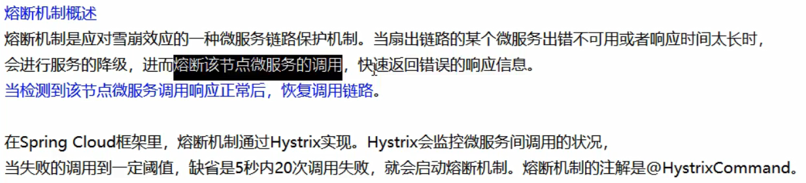

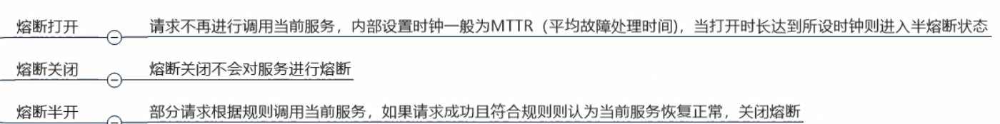

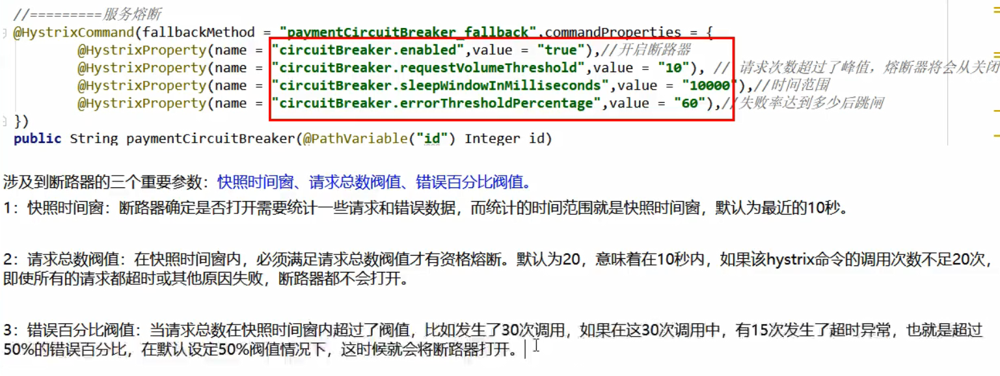

以 8001 项目为示例：

主方法:==@EnableCircuitBreaker==

```java
@SpringBootApplication
@EnableEurekaClient
@EnableCircuitBreaker
public class PaymentHystrixMain8001 {
    public static void main(String[] args) {
        SpringApplication.run(PaymentHystrixMain8001.class,args);
    }
}
```

service层的方法设置服务熔断:

```java
 	//=====服务熔断
    @HystrixCommand(fallbackMethod = "paymentCircuitBreaker_fallback", commandProperties = {
            @HystrixProperty(name="circuitBreaker.enabled", value="true"),  // 是否开启断路器
            @HystrixProperty(name="circuitBreaker.requestVolumeThreshold", value="10"),  //请求次数
            @HystrixProperty(name="circuitBreaker.sleepWindowInMilliseconds", value="10000"), // 时间窗口期
            @HystrixProperty(name="circuitBreaker.errorThresholdPercentage", value="60"),  // 失败率达到多少后跳闸
            //整体意思：10秒内 10次请求，有6次失败，就跳闸
    })
    public String paymentCircuitBreaker(Integer id){
        //模拟发生异常
        if(id < 0){
            throw new RuntimeException("*****id，不能为负数");
        }
        String serialNumber = IdUtil.simpleUUID();
        return Thread.currentThread().getName() + "\t" + "调用成功，流水号：" + serialNumber;
    }

    public String paymentCircuitBreaker_fallback(Integer id){
        return "id 不能为负数，请稍后再试....";
    }
```

controller:

```java
	//====服务熔断
    @GetMapping("/payment/circuit/{id}")
    public String paymentCircuitBreaker(@PathVariable("id")Integer id){
        return paymentService.paymentCircuitBreaker(id);
    }
```

关于解耦以后的全局配置说明：

例如上面提到的全局服务降级，并且是feign+hystrix整合，即 service 实现类的方式，如何做全局配置？

> 上面有 做全局配置时，设置超时时间的方式，我们可以从中获得灵感，即在yml文件中 进行熔断配置：
>
> ```yml
> hystrix:
> command:
>  default:
>    circuitBreaker:
>      enabled: true
>      requestVolumeThreshold: 10
>      sleepWindowInMilliseconds: 10000
>      errorThresholdPercentage: 60
> ```

## 九、服务网关-SpringCloud Gateway

### 9.1 简介

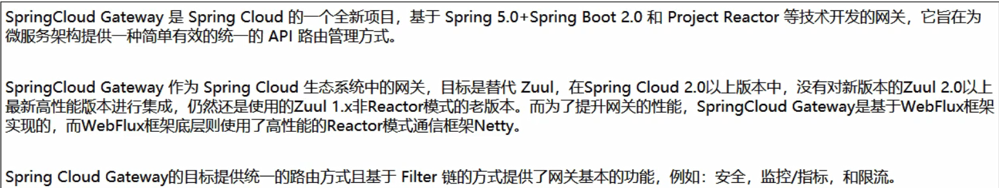

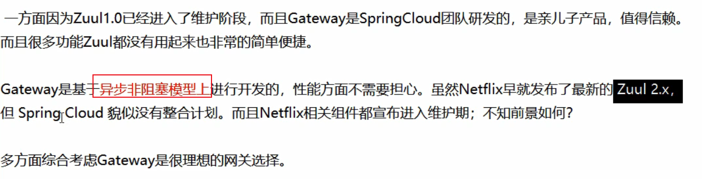

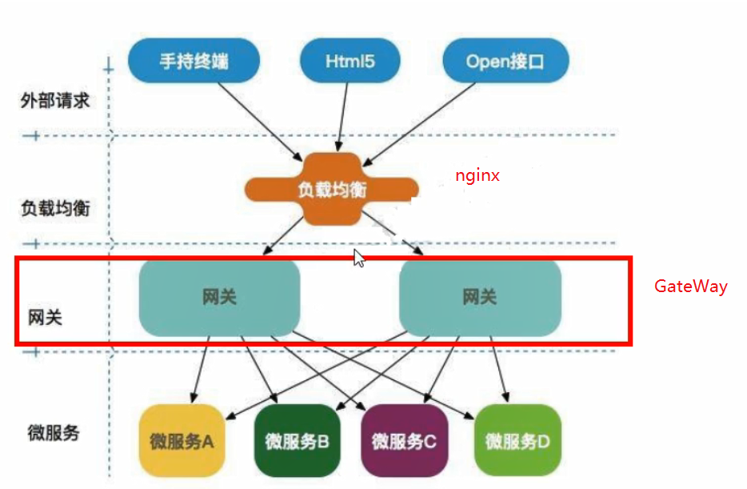

### 9.2 入门配置

新建模块cloud-gateway-gateway9527

> 现在实现==通过Gateway来访问其它项目==，这里选择之前的8001项目，要求注册进Eureka Server。其它没要求

==pom文件==：

> 主要是==网关依赖==
>
> <!--gateway-->
>         <dependency>
>             <groupId>org.springframework.cloud</groupId>
>             <artifactId>spring-cloud-starter-gateway</artifactId>
>         </dependency>
>
> 同时==注意都要注册进eureka服务器==,所以有依赖==spring-cloud-starter-netflix-eureka-client==

```xml
<dependencies>
        <!--gateway-->
        <dependency>
            <groupId>org.springframework.cloud</groupId>
            <artifactId>spring-cloud-starter-gateway</artifactId>
        </dependency>
        <!--eureka-client gateWay作为网关，也要注册进服务中心-->
        <dependency>
            <groupId>org.springframework.cloud</groupId>
            <artifactId>spring-cloud-starter-netflix-eureka-client</artifactId>
        </dependency>
    <!-- gateway和web不能同时存在，即web相关jar包不能导入 -->
        <dependency>
            <groupId>org.springframework.boot</groupId>
            <artifactId>spring-boot-devtools</artifactId>
            <scope>runtime</scope>
            <optional>true</optional>
        </dependency>
        <dependency>
            <groupId>org.projectlombok</groupId>
            <artifactId>lombok</artifactId>
            <optional>true</optional>
        </dependency>
        <dependency>
            <groupId>org.springframework.boot</groupId>
            <artifactId>spring-boot-starter-test</artifactId>
            <scope>test</scope>
        </dependency>
        <dependency><!-- 引入自己定义的api通用包，可以使用Payment支付Entity -->
            <groupId>com.atguigu.springcloud</groupId>
            <artifactId>cloud-api-commons</artifactId>
            <version>${project.version}</version>
        </dependency>
    </dependencies>
```

==yml文件==

```yml
server:
  port: 9527
spring:
  application:
    name: cloud-gateway
  ## GateWay配置
  cloud:
    gateway:
      routes:
        - id: payment_routh  # 路由ID ， 没有固定的规则但要求唯一，建议配合服务名
          uri: http://localhost:8001  # 匹配后提供服务的路由地址
          predicates:
            - Path=/payment/get/**  # 断言，路径相匹配的进行路由

        - id: payment_routh2  # 路由ID ， 没有固定的规则但要求唯一，建议配合服务名
          uri: http://localhost:8001  # 匹配后提供服务的路由地址
          predicates:
            - Path=/payment/lb/**  # 断言，路径相匹配的进行路由

# 注册进 eureka Server
eureka:
  client:
    service-url:
      defaultZone: http://eureka7001:7001/eureka/
    register-with-eureka: true
    fetch-registry: true
```

==主启动类==,除了==注解@EnableEurekaClient==没什么特别配置

```java
@SpringBootApplication
@EnableEurekaClient
public class GatewayMain9527 {
    public static void main(String[] args) {
        SpringApplication.run(GatewayMain9527.class,args);
    }
}
```

访问测试：1 启动eureka Server，2 启动 8001 项目，3 启动9527（Gateway项目）

> 可见，当我们访问 http://localhost:9527/payment/get/1 时，即访问网关地址时，会给我们转发到 8001 项目的请求地址，以此作出响应。
>
> 加入网关前：http://localhost:8001/payment/get/1
>
> 加入网关后：http://localhost:9527/payment/get/1

### 9.3 动态配置

> 这里所谓的动态配置就是利用服务注册中心，来实现 负载均衡 的调用 多个微服务。
>
> 注意，这是==GateWay 的负载均衡==

上述yml配置修改如下：

```yml
spring:
  application:
    name: cloud-gateway
  cloud:
    gateway:
      discovery:
        locator:
          enabled: true # 开启从注册中心动态创建路由的功能，利用微服务名进行路由
      routes:
        - id: payment_routh  # 路由ID ， 没有固定的规则但要求唯一，建议配合服务名
         # uri: http://localhost:8001  # 匹配后提供服务的路由地址
          uri: lb://CLOUD-PROVIDER-SERVICE
          predicates:
            - Path=/payment/get/**  # 断言，路径相匹配的进行路由

        - id: payment_routh2  # 路由ID ， 没有固定的规则但要求唯一，建议配合服务名
        #  uri: http://localhost:8001  # 匹配后提供服务的路由地址
          uri: lb://CLOUD-PROVIDER-SERVICE
          predicates:
            - Path=/payment/lb/**  # 断言，路径相匹配的进行路由

# uri: lb://CLOUD-PROVIDER-SERVICE  
# 解释：lb 属于GateWay 的关键字，代表是动态uri，即代表使用的是服务注册中心的微服务名，它默认开启使用负载均衡机制 
# 在微服务下CLOUD-PROVIDER-SERVICE的所有provider都能访问到
```

### 9.4 Predicate

> 注意到上面yml配置中，有个predicates 属性值。

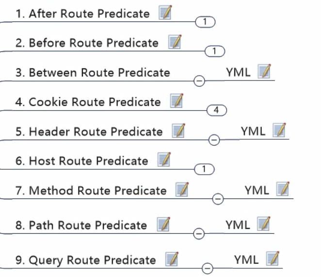

具体使用：

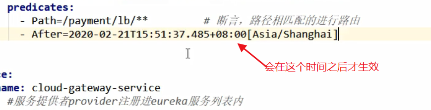

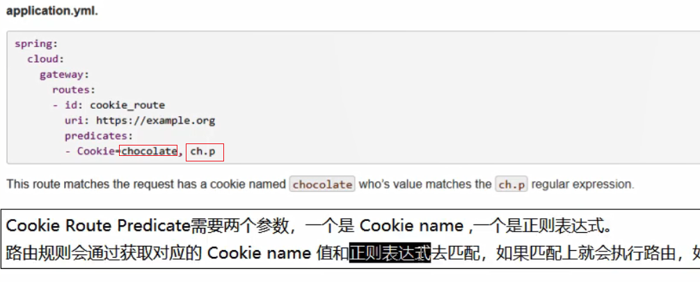

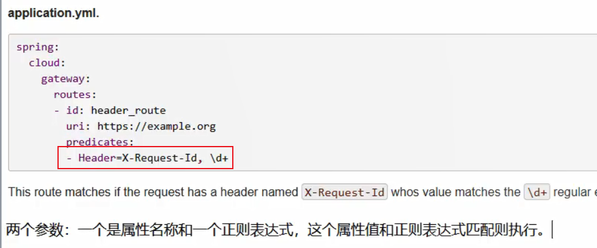

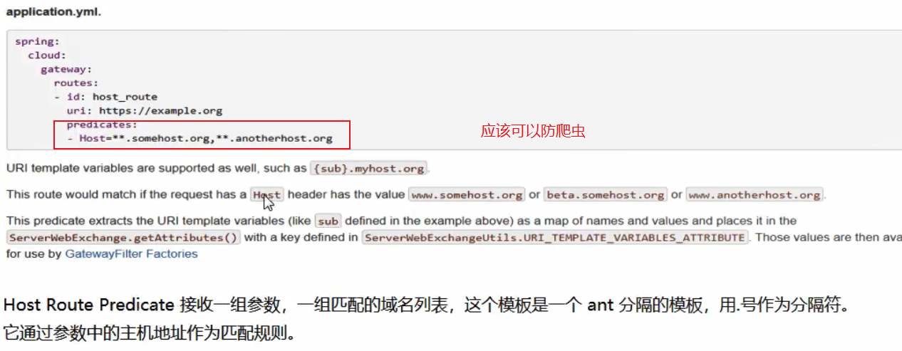

> 放爬虫思路，前后端分离的话，只限定前端项目主机访问，这样可以屏蔽大量爬虫。
>
> 例如我加上： - Host=localhost:**       ** 代表允许任何端口
>
> 就只能是主机来访

配置错误页面:

> 注意，springboot默认/static/error/ 下错误代码命名的页面为错误页面，即 404.html
>
> 而且不需要导入额外的包，Gateway 里面都有。

### 9.5 Filter

> 主要是配置全局自定义过滤器，其它的小配置具体看官网吧

自定义全局过滤器配置类：

```java
@Component
public class GateWayFilter implements GlobalFilter, Ordered {

    @Override
    public Mono<Void> filter(ServerWebExchange exchange, GatewayFilterChain chain) {
        System.out.println("------come in MyGlobalFilter : "+ new Date());
        String uname = exchange.getRequest().getQueryParams().getFirst("uname");
        //合法性检验
        if(uname == null){
            System.out.println("----用户名为null,非法用户，请求不被接受");
            //设置 response 状态码   因为在请求之前过滤的，so就算是返回NOT_FOUND 也不会返回错误页面
            exchange.getResponse().setStatusCode(HttpStatus.NOT_FOUND);
            //完成请求调用
            return exchange.getResponse().setComplete();
        }
        return chain.filter(exchange);
    }

    //返回值是加载顺序，一般全局的都是第一位加载
    @Override
    public int getOrder() {
        return 0;
    }
}
```

## 十、服务配置-SpringCloud Config分布式配置中心

### 10.1 概述


### 10.2 服务端配置

> 首先在github上新建一个仓库 springcloud-config
>
> 然后使用git命令克隆到本地，命令：git clone https://github.com/dexlace/springcloud-config.git
>
> 注意上面的操作不是必须的，只要github上有就可以，克隆到本地只是修改文件。

==新建 cloud-config-center3344 模块：==

pom文件：

> ​       <dependency>
> ​            <groupId>org.springframework.cloud</groupId>
> ​            <artifactId>spring-cloud-config-server</artifactId>
> ​        </dependency>

```xml
<dependencies>
        <!-- config Server -->
        <dependency>
            <groupId>org.springframework.cloud</groupId>
            <artifactId>spring-cloud-config-server</artifactId>
        </dependency>

        <!--eureka-client config Server也要注册进服务中心-->
        <dependency>
            <groupId>org.springframework.cloud</groupId>
            <artifactId>spring-cloud-starter-netflix-eureka-client</artifactId>
        </dependency>
        <dependency>
            <groupId>org.springframework.boot</groupId>
            <artifactId>spring-boot-devtools</artifactId>
            <scope>runtime</scope>
            <optional>true</optional>
        </dependency>
        <dependency>
            <groupId>org.projectlombok</groupId>
            <artifactId>lombok</artifactId>
            <optional>true</optional>
        </dependency>
        <dependency>
            <groupId>org.springframework.boot</groupId>
            <artifactId>spring-boot-starter-test</artifactId>
            <scope>test</scope>
        </dependency>
        <dependency><!-- 引入自己定义的api通用包，可以使用Payment支付Entity -->
            <groupId>com.atguigu.springcloud</groupId>
            <artifactId>cloud-api-commons</artifactId>
            <version>${project.version}</version>
        </dependency>
    </dependencies>
```

==yml 配置：==

```yml
server:
  port: 3344
spring:
  application:
    name: cloud-config-center  # 注册进eureka Server 的微服务名
  cloud:
    config:
      server:
        git:
          uri: https://github.com/dexlace/springcloud-config.git # github 仓库位置
          ## 搜索目录
          search-paths:
            - springcloud-config
          # 读取的分支
          label: master
eureka:
  client:
    service-url:
      defaultZone: http://eureka7001:7001/eureka/,http://eureka7002:7002/eureka/
```

==主启动类：==

```java
@SpringBootApplication
@EnableConfigServer   //关键注解
public class ConfigCenterMain3344 {
    public static void main(String[] args) {
        SpringApplication.run(ConfigCenterMain3344.class,args);
    }
}
```

==添加模拟映射：【C:\Windows\System32\drivers\etc\hosts】文件中添加：  127.0.0.1 config-3344.com==

==启动微服务3344，访问http://config-3344.com:3344/master/config-dev.yml 文件（注意，要提前在git上弄一个这文件==

==文件命名和访问的规则：==


==不加分支名默认是master:==


### 10.3 客户端配置

> 这里的客户端指的是，使用 Config Server 统一配置文件的项目。==既有之前说的消费者，又有提供者==

新建cloud-config-client3355模块

==pom文件：==

> 主要是依赖
>
> ​        <dependency>
> ​            <groupId>org.springframework.cloud</groupId>
> ​            <artifactId>spring-cloud-starter-config</artifactId>
> ​        </dependency>

```xml
<dependencies>
        <!-- config Client 和 服务端的依赖不一样 -->
        <dependency>
            <groupId>org.springframework.cloud</groupId>
            <artifactId>spring-cloud-starter-config</artifactId>
        </dependency>

        <!--eureka-client config Server也要注册进服务中心-->
        <dependency>
            <groupId>org.springframework.cloud</groupId>
            <artifactId>spring-cloud-starter-netflix-eureka-client</artifactId>
        </dependency>
        <dependency>
            <groupId>org.springframework.boot</groupId>
            <artifactId>spring-boot-starter-web</artifactId>
        </dependency>
        <dependency>
            <groupId>org.springframework.boot</groupId>
            <artifactId>spring-boot-starter-actuator</artifactId>
        </dependency>
        <dependency>
            <groupId>org.springframework.boot</groupId>
            <artifactId>spring-boot-devtools</artifactId>
            <scope>runtime</scope>
            <optional>true</optional>
        </dependency>
        <dependency>
            <groupId>org.projectlombok</groupId>
            <artifactId>lombok</artifactId>
            <optional>true</optional>
        </dependency>
        <dependency>
            <groupId>org.springframework.boot</groupId>
            <artifactId>spring-boot-starter-test</artifactId>
            <scope>test</scope>
        </dependency>
        <dependency><!-- 引入自己定义的api通用包，可以使用Payment支付Entity -->
            <groupId>com.atguigu.springcloud</groupId>
            <artifactId>cloud-api-commons</artifactId>
            <version>${project.version}</version>
        </dependency>
    </dependencies>
```

==**bootstrap.yml文件**==


```yml
server:
  port: 3355

spring:
  application:
    name: config-client
  cloud:
    # config 客户端配置
    config:
      label: master # 分支名称
      name: config # 配置文件名称
      profile: dev # 使用配置环境
      uri: http://config-3344:3344  # config Server 地址
      # 综合上面四个 即读取配置文件地址为： http://config-3344:3344/master/config-dev.yml

eureka:
  client:
    service-url:
      defaultZone: http://eureka7001:7001/eureka/,http://eureka7002:7002/eureka/
```

注意，==不能少了application.yml文件==，就算是空的也要留着

==主启动类，极其普通：==

```java
@SpringBootApplication
@EnableEurekaClient
public class ConfigClientMain3355 
    public static void main(String[] args) {
        SpringApplication.run(ConfigClientMain3355.class, args);
    }
}
```

==controller层，测试读取配置信息==

```java
package com.atguigu.springcloud.controller;

import org.springframework.beans.factory.annotation.Value;
import org.springframework.web.bind.annotation.GetMapping;
import org.springframework.web.bind.annotation.RestController;

@RestController
public class ConfigClientController {

    @Value("${config.info}")
    private String configInfo;

    @GetMapping("/configInfo")
    public String getConfigInfo(){
        return configInfo;
    }
}
```

启动测试完成！如果报错，注意github上的 yml 格式有没有写错！ 

### 10.4 动态刷新

问题：

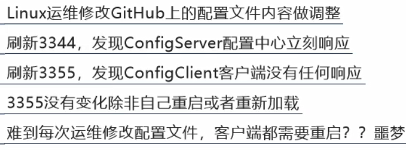

> 就是github上面配置更新了，config Server 项目上是动态更新的，但是，client端的项目中的配置，目前还是之前的，它不能动态更新，必须重启才行。

解决：

1. ==client端一定要有如下依赖：==

   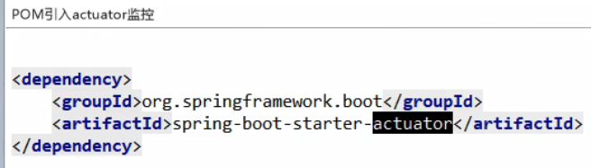

2. ==client 端增加 yml 配置如下，即在 bootstrap.yml 文件中：==

```yml
# 暴露监控端点
management:
  endpoints:
    web:
      exposure:
        include: "*"
```

3. ==在controller 上添加如下注解：==

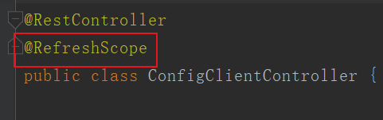

> 到此为止，配置已经完成，但是测试仍然不能动态刷新，需要下一步。

4. ==向 client 端发送一个 POST 请求==

> 如 curl -X POST "http://localhost:3355/actuator/refresh"
>
> 两个必须：1.必须是 POST 请求，2.请求地址：http://localhost:3355/actuator/refresh

成功！

但是又有一个问题，就是要向每个微服务发送一次POST请求，当微服务数量庞大，又是一个新的问题。

就有下面的消息总线！